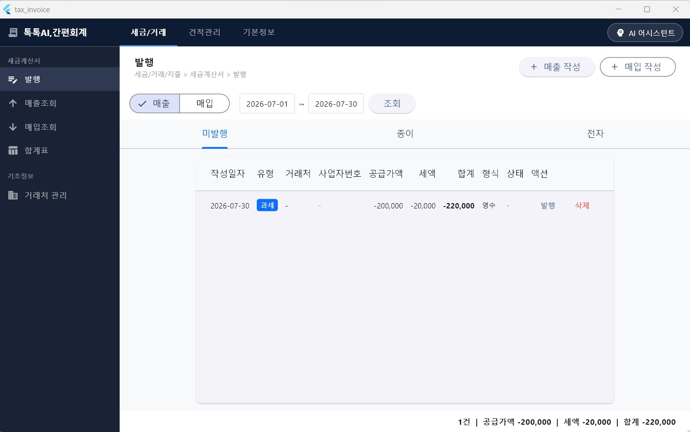
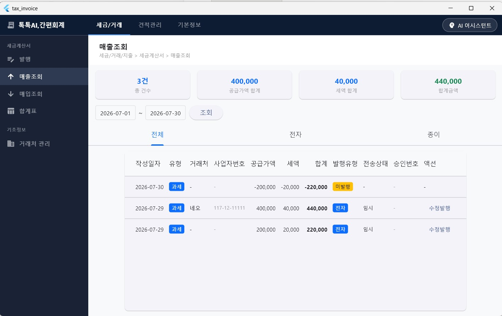
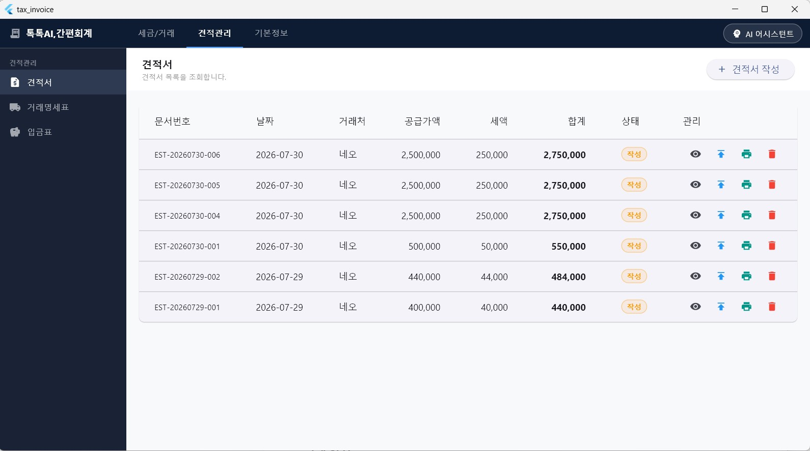
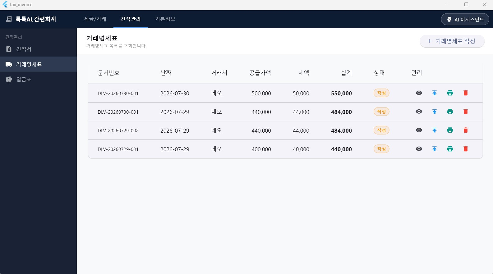
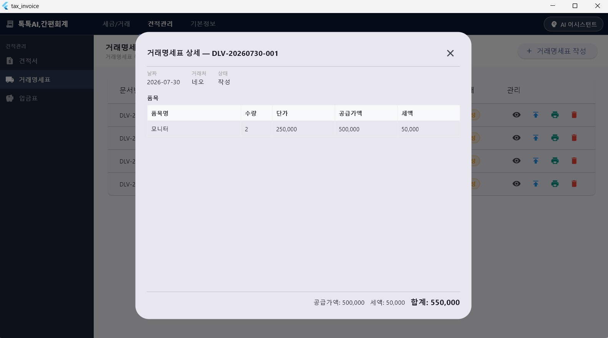
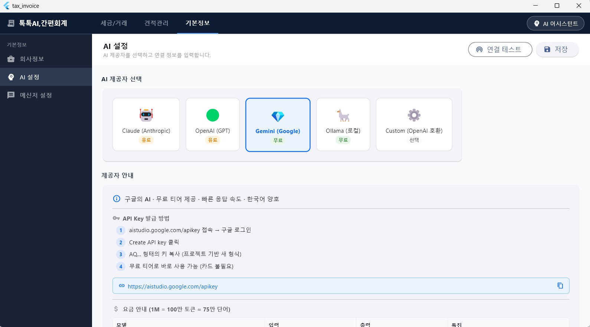
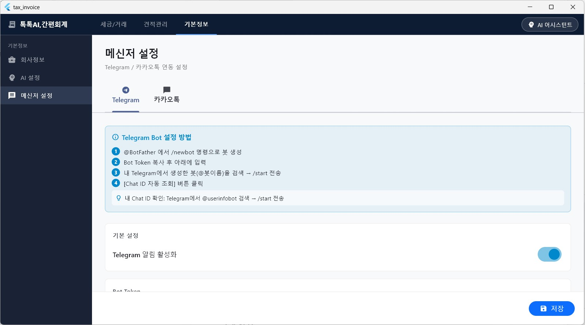
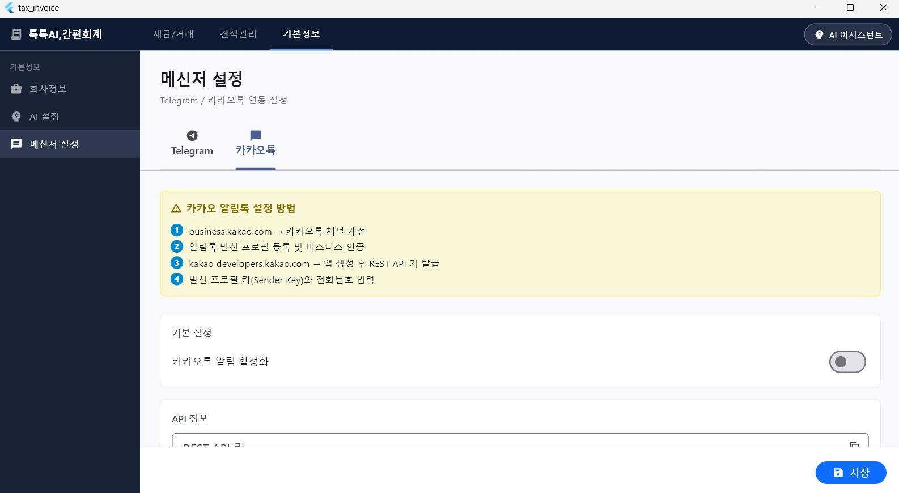

# 톡톡AI,간편회계(TokTok AI;Accounting Agent)

Program Name: TokTok AI; Accounting Agent
Author: MediaIN https://www.mediain.co.kr
E-Mail : pixel@mediain.co.kr

This project is an open-source accounting ledger designed for the Korean SOHO business environment, featuring a simple agent created for bakers that runs on a basic local SQLite DB.

For commercial services, we are developing versions for PostgreSQL, an open-source object-relational database known for its stability and scalability, in addition to MariaDB (MySQL) and MS-SQL. We are designing lightweight agent services for the web, CRM, shopping malls, and IoT devices.

We look forward to your interest and feedback.

[](https://opensource.org/licenses/MIT)


한국 스타트업·1인 법인·개인사업자·프리랜서를 위한 **AI 기반 간편 세금계산서·견적 관리 데스크톱 앱**.  
자연어로 "ABC회사 모니터 2개 50만원 견적서 작성"이라고 입력하면 AI가 자동으로 문서를 생성하고 리스트에 등록합니다.  
텔레그램 봇으로도 동일하게 명령할 수 있습니다.

**라이선스**: MIT  
**버전**: 1.0.0  
**플랫폼**: Windows 10/11 (64-bit)

---

## 스크린샷

### 세금/거래 — 발행 & 매출조회
| 발행 (미발행 목록) | 매출조회 (통계 카드) |
|:--:|:--:|
|  |  |

### 견적관리 — 견적서 & 거래명세표
| 견적서 목록 | 거래명세표 목록 | 거래명세표 상세 |
|:--:|:--:|:--:|
|  |  |  |

### 기본정보 — AI 설정 & 메신저 설정
| AI 설정 (Gemini/Claude/GPT) | 메신저 설정 — Telegram | 메신저 설정 — 카카오톡 |
|:--:|:--:|:--:|
|  |  |  |

---

## 주요 기능

| 구분 | 기능 |
|------|------|
| 세금/거래 | 세금계산서 발행·매출조회·매입조회·합계표·거래처관리 |
| 견적관리 | 견적서·거래명세표·입금표 작성·목록·PDF 출력 |
| AI 어시스턴트 | 자연어로 문서 작성·화면 이동·거래처 등록 |
| 텔레그램 연동 | 봇 메시지로 견적서·거래명세표·입금표 원격 등록 |
| PDF 출력 | 한글 폰트(Noto Sans KR) 지원, 입금표 2부 자동 인쇄 |
| 메신저 설정 | Telegram Bot / 카카오톡 API 설정 화면 내장 |

---

## 설계 원칙

- **자연어 입력** — "모니터 2개 50만원 견적서"처럼 말하면 AI가 품목·단가·세액을 자동 계산
- **AI 폴백 체인** — Gemini Flash Latest → Gemini 3.5 Flash → Gemini 1.5 Flash 순으로 자동 전환, 503 과부하 자동 재시도
- **오프라인 DB** — SQLite(sqflite_common_ffi)로 로컬 저장, 인터넷 없이도 문서 관리 가능
- **원격 명령** — 텔레그램 봇을 통해 외출 중에도 견적서·거래명세표 등록
- **표준 PDF** — 국세청 표준 양식에 맞는 세금계산서·입금표(A4 2부) PDF 자동 생성

---

## 화면 구성

```
톡톡AI,간편회계
├── 세금/거래
│   ├── 발행 (미발행·종이·전자)
│   ├── 매출조회
│   ├── 매입조회
│   ├── 합계표
│   └── 거래처관리
├── 견적관리
│   ├── 견적서      (EST-YYYYMMDD-NNN)
│   ├── 거래명세표  (DLV-YYYYMMDD-NNN)
│   └── 입금표      (RCP-YYYYMMDD-NNN)
└── 기본정보
    ├── 회사정보
    ├── AI 설정
    └── 메신저 설정 (Telegram / 카카오톡)
```

---

## AI 어시스턴트

앱 우측 패널에서 자연어로 모든 작업을 처리합니다.

### 지원 명령어 예시

| 입력 예시 | 처리 결과 |
|-----------|-----------|
| `ABC회사 노트북 3대 150만원 견적서` | 견적관리 → 견적서에 자동 등록 |
| `DLV-20260729-001을 매출작성에 등록해줘` | 세금/거래 → 발행(미발행) 목록에 등록 |
| `DLV-20260729-001에 입금표 등록` | 견적관리 → 입금표로 변환 등록 후 PDF 출력 |
| `거래처 홍길동상사 사업자번호 123-45-67890` | 거래처 자동 등록 |
| `매출조회 이동` | 해당 화면으로 즉시 이동 |

### AI 설정

| 제공사 | 모델 예시 | 비고 |
|--------|-----------|------|
| Gemini (Google) | `gemini-flash-latest` | AQ. 프로젝트 키 지원 |
| Claude (Anthropic) | `claude-sonnet-4-6` | |
| OpenAI | `gpt-4o-mini` | |
| Ollama | `llama3.2` | 로컬 실행 |
| Custom | 직접 입력 | OpenAI 호환 엔드포인트 |

> **Gemini AQ. 키 사용 시**: `x-goog-api-key` 헤더 방식, `gemini-flash-latest` 모델 권장  
> 503 과부하 오류 발생 시 자동으로 대체 모델로 전환합니다.

---

## 텔레그램 봇 연동

앱이 실행 중이면 5초 간격으로 텔레그램 메시지를 수신하여 자동 처리합니다.

### 설정 방법

1. Telegram에서 **@BotFather** → `/newbot` → Bot Token 발급
2. 생성한 봇에 `/start` 전송
3. 앱 → 기본정보 → 메신저 설정 → Bot Token 입력
4. **[Chat ID 자동 조회]** 클릭 → 저장
5. **[테스트 메시지 전송]** 으로 연결 확인

### 텔레그램에서 사용 가능한 명령

```
/start               → 사용 안내 출력
/help                → 명령어 목록

"네오 미니cp 5대 50만원 견적서 작성"   → 견적서 자동 등록 + 결과 답장
"ABC 컴퓨터 3대 200만원 거래명세표"    → 거래명세표 자동 등록
"DLV-xxx 매출작성에 등록해줘"          → 세금계산서 발행 목록 등록
```

### 텔레그램 봇 답장 예시

```
✅ 견적서 등록 완료!

📄 문서번호: EST-20260730-001
🏢 거래처: 네오
📦 품목:
  • 미니cp 5개 × 100,000원

💰 공급가액: 500,000원
🧾 세액: 50,000원
💵 합계: 550,000원

앱 → 견적관리 → 견적서 에서 확인하세요.
```

---

## PDF 출력

### 지원 문서 양식

| 문서 | 특징 |
|------|------|
| 견적서 | 품목 테이블, 공급자/수신자 정보 |
| 거래명세표 | 품목 테이블, 공급자/수신자 정보 |
| 입금표 | A4 1장에 2부 자동 출력 (공급받는자용 파란색 / 공급자용 빨간색) |
| 세금계산서 관련 | 발행 내역 PDF 출력 |

- **한글 폰트**: Google Noto Sans KR (자동 다운로드)
- **출력 방식**: 시스템 인쇄 대화상자 → 프린터 또는 PDF로 저장

---

## 데이터 흐름

```
[자연어 입력]
  ├─ AI 채팅 패널 (앱 내부)
  └─ 텔레그램 봇 (원격)
        ↓
  [AI 서비스]
    ├─ Gemini / Claude / GPT → JSON 액션 파싱
    └─ {"action":"create_doc", "docType":"견적서", "items":[...]}
        ↓
  [DB 처리 (SQLite)]
    ├─ insertDocument()     → 견적서·거래명세표·입금표
    ├─ insertInvoice()      → 세금계산서 (매출/매입)
    └─ insertPartner()      → 거래처 자동 등록
        ↓
  [UI 갱신]
    ├─ ValueKey 버전 카운터 → 해당 화면 강제 리로드
    └─ 텔레그램 답장 전송
```

---

## 데이터베이스 스키마 (SQLite)

| 테이블 | 용도 |
|--------|------|
| `partners` | 거래처 (상호·사업자번호·대표자·주소·연락처) |
| `invoices` | 세금계산서 (매출/매입·발행유형·승인번호) |
| `invoice_items` | 세금계산서 품목 |
| `documents` | 견적서·거래명세표·입금표 |
| `document_items` | 문서 품목 |
| `company_info` | 회사 정보 (사업자번호·인감·로고 경로) |
| `ai_settings` | AI 제공사·API 키·모델 설정 |
| `messenger_settings` | Telegram / 카카오톡 연동 설정 |

---

## 설치

### 방법 A — 설치파일 (권장)

1. [Releases](../../releases) 페이지에서 `TokTokAI_Setup_x.x.x.exe` 다운로드
2. 설치 마법사 실행 → Next → Install
3. 바탕화면 아이콘 또는 시작 메뉴에서 실행

### 방법 B — 소스 빌드

**요구사항**

- Windows 10/11 (64-bit)
- [Flutter SDK 3.x](https://docs.flutter.dev/get-started/install/windows)
- [Visual Studio 2022](https://visualstudio.microsoft.com/) (C++ 데스크톱 워크로드 포함)
- Git

**빌드**

```cmd
git clone https://github.com/your-username/tax_invoice_flutter.git
cd tax_invoice_flutter
flutter pub get
flutter run -d windows
```

**설치파일 생성**

```cmd
flutter build windows --release
```

[Inno Setup 6](https://jrsoftware.org/isdl.php) 설치 후:

```cmd
"C:\Program Files (x86)\Inno Setup 6\ISCC.exe" installer.iss
```

→ `installer_output\TokTokAI_Setup_1.0.0.exe` 생성

---

## 기술 스택

| 항목 | 내용 |
|------|------|
| UI 프레임워크 | Flutter 3.x (Windows Desktop) |
| 언어 | Dart 3.x |
| 데이터베이스 | SQLite (`sqflite_common_ffi`) |
| AI 연동 | Gemini API (네이티브) / OpenAI 호환 엔드포인트 / Anthropic API |
| PDF 생성 | `pdf ^3.11` + `printing ^5.13` + Google Fonts (Noto Sans KR) |
| HTTP | `http ^1.x` |
| 메신저 | Telegram Bot API (polling 방식) |

---

## 문제 해결

| 증상 | 해결 방법 |
|------|-----------|
| Gemini 503 오류 | `gemini-flash-latest` 모델 사용 (AQ. 키 전용 안정 별칭) |
| AI 응답 타임아웃 | 60초 타임아웃 + 자동 재시도(2회) 내장, 잠시 후 재시도 |
| 텔레그램 "bot can't send messages to the bot" | Chat ID가 봇 ID임 → @userinfobot 에서 내 ID 확인 후 재입력 |
| PDF 한글 깨짐 | 인터넷 연결 상태에서 실행 (첫 실행 시 Noto Sans KR 폰트 자동 다운로드) |
| DB 오류 (테이블 없음) | 앱 재실행 시 자동 마이그레이션 (version 4까지 자동 업그레이드) |

---

## 대상 사용자

- **스타트업 대표** — 견적서·거래명세표를 AI 명령 한 줄로 처리
- **1인 법인·개인사업자** — 세금계산서 미발행 관리 + PDF 출력
- **프리랜서** — 입금표·견적서를 텔레그램으로 외출 중 원격 등록
- **소규모 팀** — 매출·매입 합계표로 분기 실적 파악

---

## 법적 면책

본 앱이 생성하는 세금계산서·합계표는 **참고용 초안**이며, 공인세무사 검토를 대체하지 않습니다.

- 전자세금계산서 법적 효력은 국세청 홈택스 전자발행을 통해서만 발생합니다
- 법인세·부가세 신고 전 반드시 세무사 검토를 받으세요
- 본 앱의 PDF 출력물은 법적 효력이 없는 사본입니다

---

## 기여

Pull Request를 환영합니다. 특히 필요한 영역:

- 홈택스 전자세금계산서 API 연동
- 카카오 알림톡 실전 연동 (비즈채널 승인 후)
- macOS / Linux 빌드 지원
- 영수증 OCR → 자동 매입 등록
- 계정과목 분류 및 재무제표 생성

---

## License

**MIT License** — 자세한 내용은 [LICENSE](./LICENSE) 참조.

---

Built with Flutter + Gemini AI.
